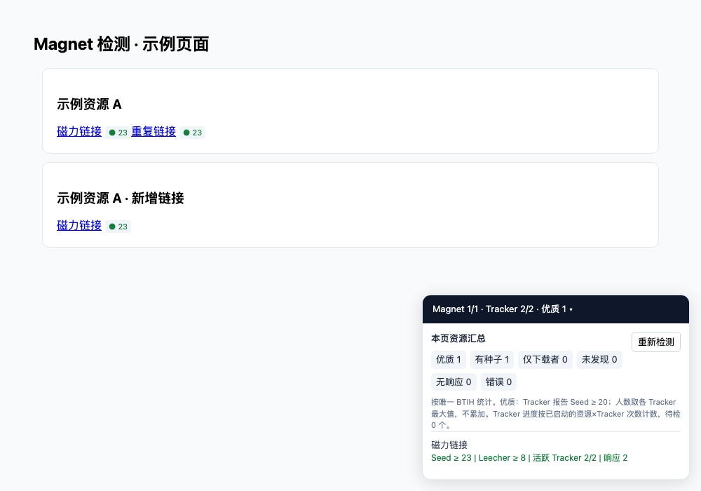

# Magnet Scout

在下载之前，查看 Magnet 链接的 Tracker 报告、种子人数和检测进度。

Magnet Scout 由本地 Python API、油猴脚本和 Tracker 筛选工具组成：脚本识别网页中的磁力链接，在链接旁显示紧凑标签，并用一个可收起的面板汇总本页资源。Python 查询 UDP、HTTP、HTTPS Tracker 的 scrape 接口，返回人数和逐次检测进度。

[安装油猴脚本](https://raw.githubusercontent.com/alongyou/magnet-scout/main/magnet-scout.user.js) · [提交问题](https://github.com/alongyou/magnet-scout/issues)

**本项目查询 Tracker 数据，不下载资源内容。Tracker 无响应不等于资源失效，有种子也不保证可以完成下载。**



*界面示例使用模拟数据。*

## 功能

- 自动识别网页 Magnet，支持动态新增、移除和修改链接。
- 短标签显示 Seed 或 Leecher 人数，不额外插入状态行或换行。
- 悬停查看详情，点击标签打开汇总面板。
- 按唯一 BTIH 汇总资源，支持十六进制和 Base32 hash；重复链接只统计一次。
- 同时显示资源完成数、Tracker 查询完成数和当前暂报人数。
- 自动下载公开 Tracker 列表，用多个测试资源重复检测、筛选并排序。
- 保存每次筛选的详细报告，更新 Tracker 列表前备份旧文件。
- 保留同步接口，提供后台检测任务及进度查询接口。

## 环境要求

- Python 3.10 或更新版本。
- 支持用户脚本的浏览器及 Tampermonkey 等脚本管理器，需支持 `GM_xmlhttpRequest`。
- 筛选及实际检测需要访问 GitHub、Ubuntu 官方下载站和公开 Tracker；支持 UDP 的网络可以检测 UDP Tracker。
- Node.js、Playwright 和 Chromium 仅用于可选的浏览器回归测试。

Python 和浏览器应运行在同一台机器上。脚本默认连接 `http://127.0.0.1:8765`。

## 快速开始

### 1. 安装依赖

下载或克隆本仓库后，进入项目目录：

```bash
git clone https://github.com/alongyou/magnet-scout.git
cd magnet-scout
python3 -m venv .venv
```

激活虚拟环境：

```bash
# macOS / Linux
source .venv/bin/activate
```

```powershell
# Windows PowerShell
.\.venv\Scripts\Activate.ps1
```

Windows 如果没有 `python3` 命令，可使用 `python` 创建虚拟环境。激活后安装依赖：

```bash
python -m pip install -r requirements.txt
```

### 2. 生成适合当前网络的 Tracker 列表

```bash
python tracker_select.py --refresh-magnets
```

此命令从 Ubuntu 官方 `.torrent` 元数据更新测试资源，下载 Tracker 列表，检测并把入选结果写入 `trackers.txt`。耗时取决于网络和超时重试；失败时终端会给出原因。

### 3. 启动本地 API

```bash
python -m uvicorn magnet_api:app --host 127.0.0.1 --port 8765
```

保持终端运行。访问 [健康检查](http://127.0.0.1:8765/health)，应返回：

```json
{"ok": true}
```

接口文档位于 [本地 Swagger UI](http://127.0.0.1:8765/docs)。

请使用单个 Uvicorn 进程。后台任务保存在进程内存中，多个 worker 无法共享进度；服务重启后，正在进行的任务需要重新检测。

### 4. 安装用户脚本

1. 在浏览器安装 Tampermonkey 等脚本管理器。
2. 打开 [Magnet Scout 安装链接](https://raw.githubusercontent.com/alongyou/magnet-scout/main/magnet-scout.user.js)，在脚本管理器中确认安装。
3. 允许脚本管理器访问 `127.0.0.1`，打开含有 Magnet 链接的网页并刷新。

也可在脚本管理器中新建脚本，粘贴 [magnet-scout.user.js](magnet-scout.user.js) 的全部内容并保存。

如果已安装旧版 `Magnet Quality Probe`，请停用或删除旧脚本后安装新版，避免同时运行两个脚本。

### 自动更新

发行脚本配置了仓库的更新地址：

```javascript
// @updateURL    https://raw.githubusercontent.com/alongyou/magnet-scout/main/magnet-scout.meta.js
// @downloadURL  https://raw.githubusercontent.com/alongyou/magnet-scout/main/magnet-scout.user.js
```

脚本管理器通过轻量的 `.meta.js` 文件检查版本，再从 `.user.js` 下载完整脚本。请在脚本管理器中启用更新检查，也可以手动执行“检查更新”。更新频率取决于脚本管理器设置。

更新地址跟随 `main` 分支。每次发布用户脚本都需提高 `@version`，并提交重新生成的发布文件。手动编辑已安装脚本的自定义配置可能被更新覆盖。

油猴更新只更新浏览器脚本。本地 Python API 更新需在仓库目录执行 `git pull`、按需重新安装依赖并重启服务。若 `main` 中的脚本开始依赖新的 API 功能，请同时更新服务。

默认匹配所有 HTTP/HTTPS 网页，可修改脚本头部的 `@match`，只在指定站点启用。API 地址在脚本的 `API_URL` 常量中配置。

## 网页展示与进度

| 标签 | 含义 |
| --- | --- |
| `● 23` | Tracker 报告 Seed ≥ 23 |
| `◐ 8` | Seed 0，有 Leecher |
| `○ 0` | 有有效响应，目前未发现 Seed/Leecher |
| `?` | Tracker 无有效响应，资源可用性未知 |
| `… 12/30 · S23` | 完成 12 次查询，共 30 次；当前暂报 Seed ≥ 23 |
| `…` | 等待检测或正在提交任务 |
| `!` | API、进度读取或响应格式错误，悬停查看原因 |

右下角面板显示资源完成数、Tracker 查询完成数和优质资源数量。展开后可查看每个资源的详情，点击资源行可滚动到对应链接。

服务端每完成一次 Tracker 查询就更新进度，失败和超时也算完成。网页每 **0.5 秒**读取最新快照，因此多次快速完成的查询可能合并显示。进度按“资源 × Tracker”的查询次数统计，只包含已启动的资源；尚未启动的资源单独显示待检数量。

每批最多提交 8 个资源，各批次串行检测；批次内部并发查询 Tracker。重新检测按钮在当前批次检测中暂时禁用。

### 人数和“优质”的含义

- Seed、Leecher 分别取有效 Tracker 响应中的**最大值**，不累加。
- scrape 返回人数，没有 Peer 地址或 ID，因此无法精确去重跨 Tracker 的 Peer。显示的 `≥` 表示至少达到某个 Tracker 的报告值，不是经过 Peer 连接验证的真实总人数。
- 不同资源的人数也不相加为“总在线 Peer 数”。
- 网页中的“优质资源”默认指报告 Seed ≥ 20，可修改 `GOOD_SEEDS`。
- Tracker 服务器的“优质”按响应成功率和延迟筛选，与资源人数标准不同。

协议参考：[UDP Tracker scrape（BEP 15）](https://www.bittorrent.org/beps/bep_0015.html#scrape)、[HTTP scrape（BEP 48）](https://www.bittorrent.org/beps/bep_0048.html)。

## Tracker 自动筛选

日常重跑，使用现有测试资源：

```bash
python tracker_select.py
```

更新官方测试资源并重新筛选：

```bash
python tracker_select.py --refresh-magnets
```

仅更新官方测试资源：

```bash
python tracker_select.py --refresh-magnets-only
```

脚本读取 [ngosang/trackerslist](https://github.com/ngosang/trackerslist) 的当前 `master` 提交，下载该提交下所有 `trackers_*.txt`，保存到 `tracker_cache/<commit>/`，对 `trackers_all.txt` 中的去重候选进行检测。各文件来自同一个提交，便于复查来源。

默认标准：

| 参数 | 默认值 | 说明 |
| --- | --- | --- |
| `--rounds` | `2` | 每个候选对全部测试 hash 检测的轮数 |
| `--workers` | `16` | 并发检测的 Tracker 数量 |
| `--timeout` | `3` | 每次 socket/HTTP 请求超时，单位秒 |
| `--min-success` | `0.8` | 最低有效响应比例 |
| `--max-latency-ms` | `2000` | 成功响应的最高中位延迟，单位毫秒 |
| `--limit` | `0` | 最多保存多少个结果；0 表示全部入选者 |

入选结果按成功率降序、延迟升序排列。DNS 查询和多地址重试可能使总耗时超过单次请求超时。

返回 Seed/Leecher 均为 0 仍算有效响应，不会因为没有登记测试资源就直接淘汰该 Tracker。活跃测试资源数量另记在报告中。其他 hash 的 HTTP scrape 数据不算有效响应。

调整筛选标准：

```bash
python tracker_select.py --rounds 3 --min-success 0.9 --max-latency-ms 1500 --limit 30
```

使用本地候选列表：

```bash
python tracker_select.py --input my_trackers.txt
```

可以通过 `--magnets`、`--output`、`--cache`、`--report` 指定文件路径。完整参数见：

```bash
python tracker_select.py --help
```

### 输出与更新

- `trackers.txt`：当前网络下筛选出的 Tracker，供 API 使用。
- `tracker_report.json`：来源提交、测试 hash、阈值、每次查询结果和淘汰原因。
- `tracker_cache/`：下载的原始列表、官方 `.torrent` 元数据和来源清单。
- `trackers.txt.<UTC时间>.bak`：替换前的旧列表。

下载失败或没有任何入选者时，保留现有 `trackers.txt`。文件写入采用临时文件替换。API 每次检测重新读取列表，更新 Tracker 文件无需重启服务，已有任务继续使用提交时的列表。

API 优先使用筛选后的 Tracker，再补充 Magnet 自带 Tracker，每个资源最多检测 30 个。结果反映当前网络的一次重复测量，建议在网络环境改变后重新筛选。脚本不会自动安装定时任务。

## 测试资源：magnets.txt

将测试资源与服务器列表分开维护：`magnets.txt` 保存测试 hash 或链接，`trackers.txt` 保存筛选结果。

每行可以是以下任一种格式，空行和 `#` 注释会被忽略：

```text
# 完整 Magnet
magnet:?xt=urn:btih:<40位十六进制或32位Base32的BTIH>&dn=Example

# 也可以直接填写 BTIH
<40位十六进制BTIH>
<32位Base32BTIH>
```

以上尖括号内容是格式占位符，请替换成有效 hash。

仓库中的公开测试样例来自 [Ubuntu 24.04](https://releases.ubuntu.com/24.04/) 和 [Ubuntu 26.04](https://releases.ubuntu.com/26.04/) 官方 Desktop、Server 镜像，共 4 个。每个样例都记录 `.torrent` 来源；刷新时从两个发布目录选择当前最新对应镜像，hash 按原始 bencode `info` 字节计算。

`--refresh-magnets` 会替换 `magnets.txt`。自行维护测试资源后，日常运行不加此参数，或通过 `--magnets` 使用另一个文件。更新官方样例只下载 `.torrent` 元数据，不下载 ISO。

## API

| 方法 | 路径 | 用途 |
| --- | --- | --- |
| GET | `/health` | 健康检查 |
| POST | `/api/magnets/jobs` | 创建后台检测任务，立即返回初始进度和 `job_id` |
| GET | `/api/magnets/jobs/{job_id}` | 读取进度、暂报人数和完成状态 |
| POST | `/api/magnets/probe` | 兼容同步检测，等待结果后返回 |

请求示例中的 hash 为格式示例：

```json
{
  "schema": "magnet-probe/v3",
  "items": [
    {
      "info_hash": "0123456789ABCDEF0123456789ABCDEF01234567",
      "magnet": "magnet:?xt=urn:btih:0123456789ABCDEF0123456789ABCDEF01234567",
      "title": "Example",
      "trackers": []
    }
  ]
}
```

任务响应包含 `done`、`trackers_completed`、`trackers_total` 和每个资源的 `results`。失败查询计入完成数，有效响应另计入 `trackers_responded`。任务数量有上限，创建新任务时会清理完成的旧任务；这不是持久化任务队列。

## 测试

Python 回归测试无需访问外部 Tracker：

```bash
python -m unittest -v
```

可选的真实浏览器测试：

```bash
npm install
npx playwright install chromium
npm run test:browser
```

测试覆盖紧凑布局、旧标签清理、重复链接、动态页面、分批查询、逐 Tracker 进度、重试和 API 错误。浏览器测试模拟 API 响应，不依赖外部 Tracker。

可以通过 `PROBE_TEST_BROWSER` 指定已有 Chromium 可执行文件。浏览器测试生成的 `ui-preview.png` 不纳入版本管理；README 中的界面图保存在 `docs/images/`。

## 常见问题

**链接旁没有标签**：确认脚本已启用且匹配当前页面。当前只检测 `a` 标签 `href` 中的 Magnet，不检测纯文本、按钮里的自定义属性或 BitTorrent v2 的 `btmh` hash。

**显示 API 错误**：先检查 `/health`，确认 Python 服务正在运行，端口和脚本配置一致，脚本管理器允许访问本地地址。改动 API 代码后需要重启服务。

**显示 `?` 或没有种子**：检查网络及报告里的错误原因。Tracker 可能不支持 scrape、没有登记该资源或暂时不可达；其他客户端仍可能通过 DHT、PEX 或不同 Tracker 找到资源。

**筛选没有结果**：查看 `tracker_report.json` 和终端输出，确认测试资源有效、候选列表和网络可用。可以调整超时和筛选阈值；原输出会保留。

## 数据与范围

用户脚本向本地 API 发送识别出的 Magnet、hash、标题、Tracker 和来源页面 URL。Tracker 查询发送资源 hash；本项目没有云端服务。默认 API 只监听本机地址。

本项目不获取资源 metadata 或文件列表，不验证 Peer 能否传输内容，也不实现 DHT/PEX。当前浏览器回归测试使用 Chromium；脚本在具体网站和脚本管理器中的行为可能受页面结构、浏览器设置影响。

## 贡献

欢迎通过 Issue 报告问题或提交 Pull Request。报告问题时请提供 Python/浏览器版本、运行命令、错误输出和可以公开的复现样例。

用户脚本源文件是 `magnet_checker.js`；`magnet-scout.user.js` 和 `magnet-scout.meta.js` 是生成的发布文件。改动源文件后运行：

```bash
python scripts/build_userscript.py
python scripts/build_userscript.py --check
```

发布时同步提高源文件中的 `@version` 和项目版本，保持 `@name`、`@namespace` 稳定，并将源文件和两个生成文件一起提交。

提交前运行相关测试。不要提交虚拟环境、Tracker 缓存、筛选报告、备份或包含私人资源的测试列表。

## License 与来源

本项目独立编写的代码和文档采用 [MIT License](LICENSE)，版权署名为 `waterlin`。

Tracker 数据来源：[ngosang/trackerslist](https://github.com/ngosang/trackerslist)，该仓库的 [LICENSE](https://github.com/ngosang/trackerslist/blob/master/LICENSE) 为 GPL-2.0。下载和筛选得到的数据不因本项目的 MIT License 而改变许可；本仓库通过运行时获取列表，不随源码提交缓存或筛选结果。

Ubuntu 镜像及相关第三方内容的权利归各自权利人所有。`magnets.txt` 记录公开资源的引用和来源，本项目的 MIT License 不为镜像内容重新授权。
